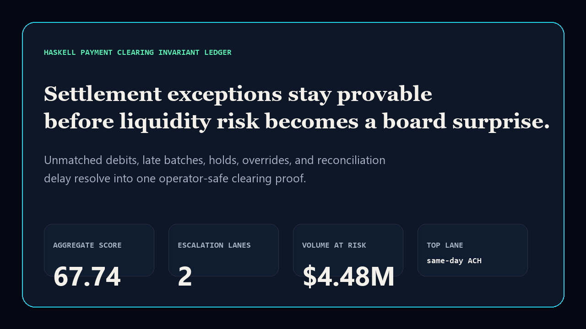
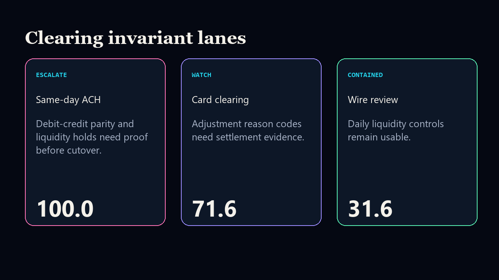

# haskell-payment-clearing-invariant-ledger

[](https://github.com/mizcausevic-dev/haskell-payment-clearing-invariant-ledger/actions/workflows/ci.yml)
[](https://github.com/mizcausevic-dev/haskell-payment-clearing-invariant-ledger/actions/workflows/pages.yml)
[](LICENSE)

Haskell Payment Clearing Invariant Ledger turns unmatched debits, late batches, liquidity holds, manual overrides, and reconciliation delay into one executive-ready clearing proof.

## What this product does

This product gives payments, treasury, risk, finance, and platform leaders a shared ledger for clearing-lane exposure. Instead of reviewing unmatched debits, late batches, liquidity holds, manual overrides, and reconciliation delay as separate exception queues, it turns them into one executive-readable view of settlement trust and volume at risk.

The SaaS go-to-market analyst view is that payment reliability is a buyer-confidence signal. If clearing exceptions are visible only inside operational tooling, sales, partnerships, investor updates, and enterprise trust conversations can overstate readiness. This ledger makes the risk story concrete: which rail is exposed, how much volume is under pressure, who owns it, and what moves next.

The SaaS value architect view is focused on cost of delay. Clearing gaps can trap liquidity, increase manual operations, create partner escalations, and force expensive remediation if leadership sees the issue after the settlement window. The surface prioritizes lanes by invariant score, volume at risk, owner, and next action.

Technically, the repo demonstrates a FinTech / Haskell signal without using production payment data or credentials. It includes a Python scoring model, Haskell invariant contract, SQL evidence contract, synthetic fixtures, CLI output, deterministic tests, static rendering, and smoke checks. The shared Kinetic Gain pattern is to convert operational exceptions into decision-ready proof that is readable by executives and inspectable by technical reviewers.

## Why this exists

- Payment risk gets vague when settlement exceptions, holds, overrides, and parity checks live in separate operating reviews.
- Haskell is a high-signal language for invariant-heavy financial systems, even when the public surface is Python and SQL friendly.
- The repo gives practical FinTech / clearing / Haskell proof without using production payment data or credentials.

## Screenshots





## What it includes

- Python scoring model and CLI.
- Haskell invariant contract.
- SQL evidence contract for reviewed clearing fields.
- Static GitHub Pages executive surface.
- Synthetic payment-clearing fixture data.
- CI, Pages deploy, smoke checks, screenshots, docs, and security notes.

## Local run

```bash
python -m pip install -e .
python -m unittest discover -s tests
python scripts/run_demo.py
python scripts/check_sql.py
python scripts/check_haskell_contract.py
python scripts/prerender.py
python scripts/smoke_check.py
```

## CLI

```bash
haskell-payment-clearing-invariant-ledger fixtures/clearing_lanes.json
haskell-payment-clearing-invariant-ledger fixtures/clearing_lanes.json --format json
```

## Board question answered

> Which clearing lanes threaten settlement proof, liquidity posture, and payment-risk narrative before the next board or investor review?
